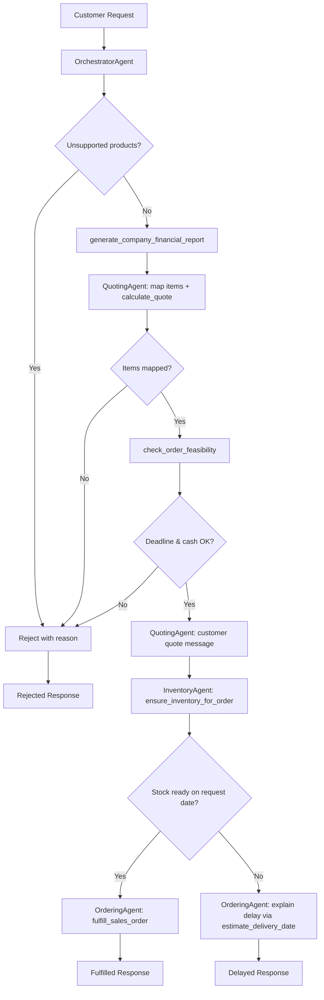

# Munder Difflin Multi-Agent Workflow Diagram

## Agent Architecture (4 agents)

| Agent                 | Role                                                                       |
| --------------------- | -------------------------------------------------------------------------- |
| **OrchestratorAgent** | Receives customer inquiries, runs pre-flight checks, delegates to workers  |
| **QuotingAgent**      | Maps requests to catalog items, searches quote history, calculates pricing |
| **InventoryAgent**    | Checks stock, reorders from suppliers when short                           |
| **OrderingAgent**     | Validates feasibility, fulfills sales, records transactions                |

## System Flow

## Tool-to-Helper Function Mapping

| Tool                                | Starter Helper Function                                                | Agent                        |
| ----------------------------------- | ---------------------------------------------------------------------- | ---------------------------- |
| `check_stock_for_item`              | `get_stock_level`                                                      | Inventory, Ordering          |
| `check_all_inventory`               | `get_all_inventory`                                                    | Inventory, Orchestrator      |
| `reorder_stock`                     | `create_transaction`, `get_supplier_delivery_date`, `get_cash_balance` | Inventory                    |
| `search_historical_quotes`          | `search_quote_history`                                                 | Quoting                      |
| `estimate_delivery_date`            | `get_supplier_delivery_date`                                           | Quoting, Inventory, Ordering |
| `get_available_cash`                | `get_cash_balance`                                                     | Ordering                     |
| `fulfill_sales_order`               | `create_transaction`, `get_stock_level`                                | Ordering                     |
| `get_financial_snapshot`            | `generate_financial_report`                                            | Orchestrator, Ordering       |
| `generate_company_financial_report` | `generate_financial_report`                                            | Orchestrator, Ordering       |
| `check_order_feasibility`           | `get_stock_level`, `get_supplier_delivery_date`, `get_cash_balance`    | Ordering                     |
| Database bootstrap                  | `init_database`, `generate_sample_inventory`                           | Test harness                 |

## Data Flow Summary

1. **Input**: Customer text request + metadata (job, order size, event, date)
2. **Quoting**: Catalog mapping → historical quote search → bulk discount calculation
3. **Inventory**: Per-item stock check → supplier reorder if needed
4. **Ordering**: Cash/deadline validation → sales transaction or rejection
5. **Output**: Combined text response with quote, inventory actions, and fulfillment status

